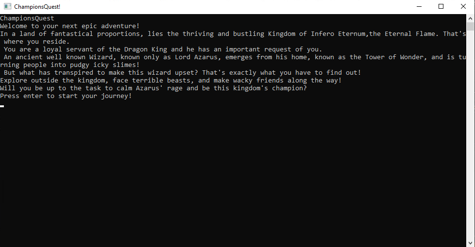

# Hello! Check out some of my stuff!

## Study Application

A study application that uses terms and definitions relative to programming and presents them in random order to the player/user.
It extracts those terms and defintions from an external text file.

## Trivia Game

A trivia game application inspired by the video game series: Legend Of Zelda. The player/user are presented with questions relating to the games and must try to answer them all correctly.

## Adventure Game

A simple text adventure game, still a work in progress. It's about the player/user becoming appointed by the Dragon King as their Champion, and must
help out an angry and distraught Wizard that's turning people into slimes.
